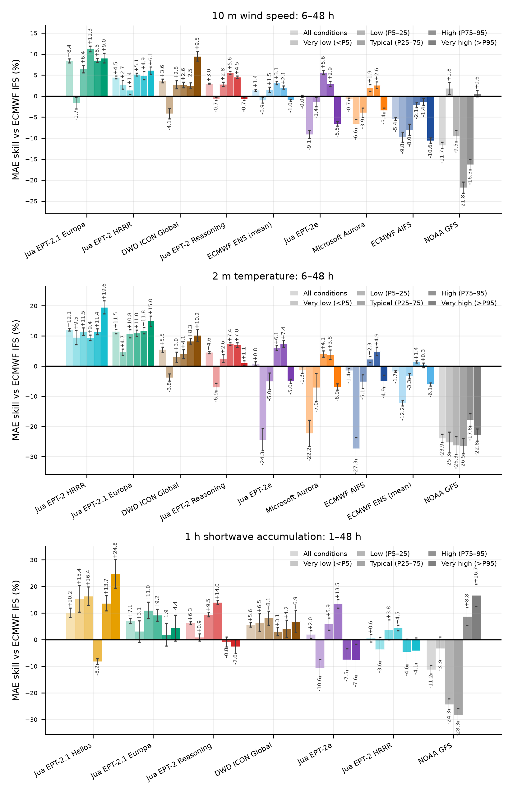
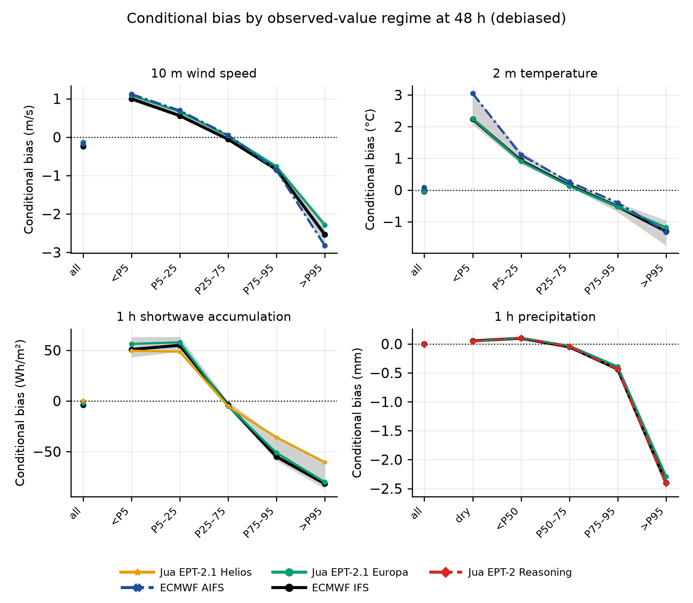

# Do AI weather models miss extremes?

**Evidence from ten months of verification against European weather
stations.** Jua Team, July 2026.
[**Read the paper (PDF)**](https://github.com/juaAI/aiweather-extremes/releases/latest)

AI weather models are widely believed to smooth extremes. That belief rests
on studies of first-generation deterministic-regression models
(FourCastNet, Pangu-Weather, GraphCast, FuXi), verified mostly against
reanalysis — a truth that is itself smooth at station scale. We tested the
claim directly: eleven forecast systems spanning physical NWP,
deterministic-regression AI, generative AI ensembles, and a
solar-specialised model, verified against European synoptic,
solar-radiation and rain-gauge stations for 10 m wind, 2 m temperature,
hourly shortwave accumulation, and hourly precipitation, with identical
causal debiasing, initialisation
days matched across models, and extremes defined the standard way —
percentiles of a 30-year ERA5 (1991–2020) climatology at each station,
calendar day, and hour of day (wet-hour percentiles for precipitation).

**The claim does not survive.**



## Key results

MAE skill against operational ECMWF IFS, thirteen countries, ±1
leave-one-month-out jackknife SE. Track A is September 2025 – June 2026,
6–48 h for wind and temperature; solar and precipitation use 1–48 h.

- **The leading generative regional ensembles beat IFS by 8.4% (wind,
  Jua EPT-2.1 Europa) and 12.1% (temperature, Jua EPT-2 HRRR, just ahead
  of EPT-2.1 Europa's 11.5%) across all conditions** — and stay ahead above the
  climatological 95th percentile: +9.0 ± 1.2% at gale-force wind (EPT-2.1 Europa)
  and +19.6 ± 2.2% in heat (EPT-2 HRRR, ahead of EPT-2.1 Europa's +15.0 ± 1.7%).
- **A purely regression-trained model (Jua EPT-2 Reasoning) stays close to
  IFS through the middle of the distribution** (+3.0% wind, +4.6%
  temperature) and only slips marginally in the wind tails (−0.7 ± 0.3% at
  gale force) — MSE training does not imply wholesale tail collapse, though
  it does lose 6.9 ± 1.3% at cold extremes.
- **The predicted failure exists, but it is model-specific, not
  AI-specific**: ECMWF AIFS loses 10.6 ± 0.6% at gale-force wind, 4.9 ± 2.0%
  in heat, and 27.3 ± 3.6% at cold extremes — while NOAA GFS, a physical
  model, loses 22.8 ± 2.0% in heat and is negative there in every country.
- **The tails do not rank models the way the mean does**: GFS is the worst
  system overall on wind (−11.7%) yet still marginally positive at gale
  force (+0.6 ± 0.7%), and DWD ICON Global leads there (+9.5 ± 1.2%) just
  ahead of EPT-2.1 Europa — the gale leaders come from opposite paradigms.
- **Every system — physical NWP included — conditionally underforecasts
  extremes** by amounts that dwarf inter-model differences (all models
  underforecast gale-regime wind by 2.2–2.9 m/s at 48 h). The residual
  tail gap is a problem for the whole field, not for AI.
- **Solar**: the specialised Jua EPT-2.1 Helios leads all conditions at
  +10.2 ± 1.7%, with its margin concentrated in the tails
  (+24.8 ± 5.4% near-clear-sky, +16.4 ± 3.4% overcast) — but it is the
  *weakest* AI system in the typical irradiance band (−8.2 ± 1.1%), where
  EPT-2 Reasoning leads (+14.0 ± 0.7%). Specialisation buys the tails at
  the cost of the bulk.
- **Against a regional physical model** (Track B, March–June 2026, hourly
  1–48 h), EPT-2.1 Europa leads all-conditions wind (+7.2 ± 0.4% vs DWD ICON-EU
  +5.3 ± 0.5%), while EPT-2.1 Europa and ICON-EU are level in the gale
  (+10.5 ± 1.4% vs +11.5 ± 1.6%) and heat (+16.6 ± 2.3% vs +17.2 ± 3.2%)
  tails. EPT-2.1 Helios has the highest solar point estimate (+12.6 ± 2.5%), and
  EPT-2 HRRR is the only regional system positive from light through high
  precipitation (up to +15.6 ± 6.1% at moderate intensity).
- **Precipitation** (wet-hour regimes): the Jua models
  beat IFS from light through high rain (up to +14–15% at moderate
  intensity and +9–11% at P75–95). At the heavy >P95 tail the ranking is
  mixed: EPT-2 Reasoning remains ahead (+1.7 ± 0.5%), EPT-2.1 Europa is near
  IFS, while EPT-2 HRRR and EPT-2e trail it. All systems under-forecast the most
  intense observed hours by roughly 2 mm, but they do not have identical
  relative MAE.



## Reproduce everything

All score-based published tables, figures, numbers, and the PDF regenerate
**offline** from committed compact aggregates (no station identities or
per-station series). The committed station-network map and illustrative model
fields are static catalogue/documentation assets:

```bash
uv sync --frozen
EXTREMES_VARIANT=_climatology uv run python scripts/make_numbers.py
EXTREMES_VARIANT=_climatology uv run python scripts/figures_v4.py
EXTREMES_VARIANT=_climatology uv run python scripts/write_paper_tables.py
EXTREMES_VARIANT=_climatology uv run python scripts/figures_precip.py
uv run python scripts/fig_appb_country_bars.py
uv run python scripts/build_paper.py
```

Each generated artifact has a single owning script; rerunning the commands is
idempotent and does not rely on script order for conflicting outputs.
`build_paper.py` sets `SOURCE_DATE_EPOCH` from the current Git commit (unless
already provided), and checks for Tectonic 0.16.9, so repeated PDF builds are
byte-identical.

### Regime definition variants

The published results use ERA5 1991–2020 climatological regimes. Consumer
scripts select the dataset variant through the
`EXTREMES_VARIANT` environment variable, and always write to the canonical
figure and table names. The command block above therefore always selects
`_climatology`; leaving it unset selects the in-window comparison dataset.

Rebuilding the climatological inputs themselves needs ClickHouse credentials
(`CH_HOST`, `CH_PORT`, `CH_USER`, `CH_PASSWORD`) and is a two-stage job:

```bash
uv run python scripts/extract_climatology_thresholds.py   # ERA5 P5/P25/P75/P95
uv run python scripts/extract_climatology_metrics.py      # score both definitions
uv run python scripts/aggregates.py --variant climatology
uv run python scripts/aggregates.py --variant window_matched   # same samples, in-window buckets
uv run python scripts/prepare_climatology_figure_data.py
uv run python scripts/fig_appb_country_bars.py --prepare
```

`extract_climatology_metrics.py` emits both bucket definitions from a single
pass, so `_climatology` and `_window_matched` are scored on identical
matched samples and are directly comparable.

Appendix B reads the committed compact
`appb_country_skill_climatology.parquet`. Its `--prepare` mode rebuilds that
file from the larger climatological metric tables when credentials and raw
inputs are available. All six regimes, including the very-low `<P5` tail, are
shown in the headline bars and skill tables.

Which artifact comes from which parquet:

| Parquet | Backs |
|---|---|
| `headline_skill_track_{a,b}.parquet` | Regime bar figures (`fig3`, `fig3b`, `fig8b`, `fig8c`) and the `t1`/`t3` skill tables — every skill number quoted in the paper text |
| `solar_lead_skill_track_a.parquet`, `track_b_lead_skill.parquet` | Lead-time curves (`fig2` solar, `fig8`) and the `t2`/`t2b` per-lead tables |
| `solar_bias_lead48_track_a_climatology.parquet` | Solar panel of the conditional-bias figure (`fig6`) |
| `final_aggregates_climatology.parquet` | Wind/temperature/precipitation panels of `fig6`, the per-country heat table (`t5`), precipitation regime/lead figures (`figp1`, `figp1b`, `figp2`, `figp6`, `figp7`) and tables (`tp1`, `tp1b`, `tp2`, `tp4`), and `reports/paper_numbers.md` |
| `precip_categorical.parquet` | Heavy-precip (>P95) detection figure (`figp5`) and table (`tp3`), and the categorical block of `reports/paper_numbers.md` |
| `appb_country_skill_climatology.parquet` | All four Appendix-B per-country regime-profile figures |

`scripts/aggregates.py` rebuilds `final_aggregates.parquet` from raw
per-country metric tables (API / local extract) and re-runs its self-test.

### Repository layout

| Path | Contents |
|---|---|
| `paper/` | LaTeX source, verified bibliography, generated table fragments |
| `figures/` | Score-based paper figures plus static `fig1_station_network.png` and `fig_model_fields.png`. Extra `fig4`/`fig5`/`fig9`/`appA`/`appC`–`appE` assets are auxiliary and not cited in `paper/main.tex` |
| `data/derived/` | Public aggregates only: `final_aggregates.parquet`, `headline_skill_track_{a,b}.parquet`, `solar_lead_skill_track_a.parquet`, `track_b_lead_skill.parquet`, `solar_bias_lead48_track_a.parquet` |
| `scripts/` | Full pipeline: extraction, aggregation + self-test, numbers, figures |
| `config/matrix.yaml` | Experiment matrix: models, tracks, windows, countries |
| `reports/paper_numbers.md` | Human-readable dump of `final_aggregates.parquet`: skill by track, variable, lead scope and regime, plus the conditional-bias and debias-delta tables |

### Raw metrics (API access required)

`scripts/extract.py` and `scripts/extract_solar_country.py` pull the raw
per-country, per-lead, per-regime metric tables from Jua's
station-verification API. Credentials come from the environment
(`JUA_API_BASE`, `JUA_API_KEY`), provided with platform access
([jua.ai](https://jua.ai)). Every request/response is cached
content-addressed, so extraction is resumable and every result traceable
to an exact request payload. The raw extraction output (~15.5M rows) ships
as a [release asset](https://github.com/juaAI/aiweather-extremes/releases).

## Methodology in one paragraph

Skill is `100 * (1 − MAE_model / MAE_ECMWF-IFS)`, computed within
sample-matched cells (initialisation days intersected across models
server-side) over all four daily cycles (00/06/12/18 UTC). For ensemble
systems MAE is taken on the ensemble mean, so this is a point-forecast
comparison and says nothing about spread or calibration. Pooling is
sample-weighted everywhere: MAE and bias linearly, RMSE quadratically.
Extremes are percentile regimes of the observed value relative to a 30-year
ERA5 (1991–2020) climatology at each station, calendar day and hour,
following the ETCCDI / WMO convention; precipitation uses wet-hour
percentiles (a dry mass below 0.1 mm plus P50/P75/P95 of the wet hours), a
multiplicative debiasing, and adds categorical >P95 detection scores. Cells
under 100 samples are excluded. Uncertainty is a leave-one-month-out
jackknife over calendar-month replicates. Full-horizon aggregates always
span a model set's complete common lead range — a 48-hour model is
aggregated over its full 48-hour horizon, never a partial slice — and
models lacking a lead are omitted, never interpolated. Every model receives
the identical, strictly causal debiasing described in the paper
(Section 3.5): a mean bias per model and hour of day, estimated on the
previous four weeks and subtracted from the following week.

## Citation

```bibtex
@misc{jua2026extremes,
  author       = {{Jua Team}},
  title        = {Do AI weather models miss extremes? Evidence from ten
                  months of verification against European weather
                  stations},
  year         = {2026},
  howpublished = {\url{https://github.com/juaAI/aiweather-extremes}}
}
```

Questions: research@jua.ai
